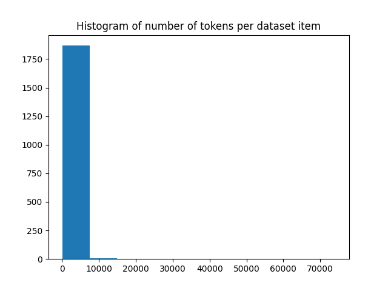
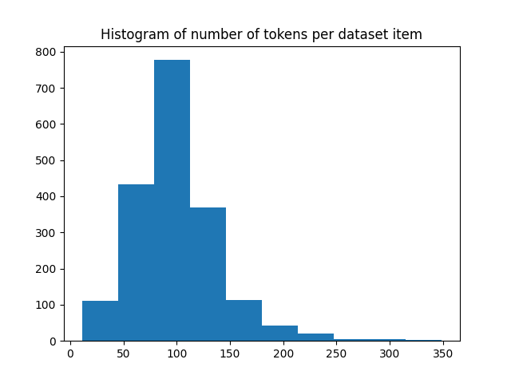

---
dataset_info:
  features:
    - name: text
      dtype: string
    - name: id
      dtype: string
    - name: metadata
      struct:
        - name: file_path
          dtype: string
        - name: repo_id
          dtype: string
        - name: token_count
          dtype: int64
    - name: __index_level_0__
      dtype: int64
  splits:
    - name: train
      num_bytes: 4387049
      num_examples: 2043
  download_size: 1468825
  dataset_size: 4387049
configs:
  - config_name: default
    data_files:
      - split: train
        path: data/train-*
---

Synth UI 🎹

https://www.synthui.design

### Dataset details

This dataset aims to provide a diverse collection of NextJS code snippets, along with their corresponding instructions, to facilitate the training of language models for NextJS-related tasks. It is designed to cover a wide range of NextJS functionalities, including UI components, routing, state management, and more.

### This dataset consists of:

> **Note:** The dataset is seperated into two main parts:
>
> - `raw` Contains only the raw code snippets
> - `instruct` Contains the code snippets along with ~2000 QA pairs

#### Raw Code Snippets

- ~2000 Code Snippets (scraped from GitHub)
- keys: `text`, `id`, `metadata`, `__index_level_0__`

#### QA pairs

- ~2000 QA pairs (augmented with GPT-4o completions)
- keys: `instruction`, `output`, `metadata`

#### Each row also stores the following metadata:

- `file_path`: The relative path to the file where the code snippet is located in the parent repository
- `repo_id`: The unique identifier of the GitHub repository
- `token_count`: The number of tokens in the code snippet (using gpt2 tokenizer)

### This dataset contains data scraped from following github repos

> **Note:** The data was scraped on 2024-10-04

```python
ICON_REPOS = [
    "lucide-icons/lucide"                               # ISC
]
UI_REPOS = [
    "shadcn-ui/ui",                                     # MIT
    "DarkInventor/easy-ui"                              # MIT
]
CODE_REPOS = [
    "moinulmoin/chadnext",                              # MIT
    "shadcn-ui/taxonomy",                               # MIT
    "horizon-ui/shadcn-nextjs-boilerplate",             # MIT
    "alifarooq9/rapidlaunch",                           # MIT
    "ixartz/SaaS-Boilerplate",                          # MIT
    "nobruf/shadcn-landing-page"                        # None
]
```

### Loading

```py
# Raw Code Snippets
dataset = load_dataset("JulianAT/SynthUI-Code-2k-v1")

# QA pairs
dataset = load_dataset("JulianAT/SynthUI-Code-Instruct-2k-v1")
```

### Token Distribution (QA)

### Code (`output` column)



### Instruction (`instruction` column)



### License

This dataset is licensed under the MIT License.
